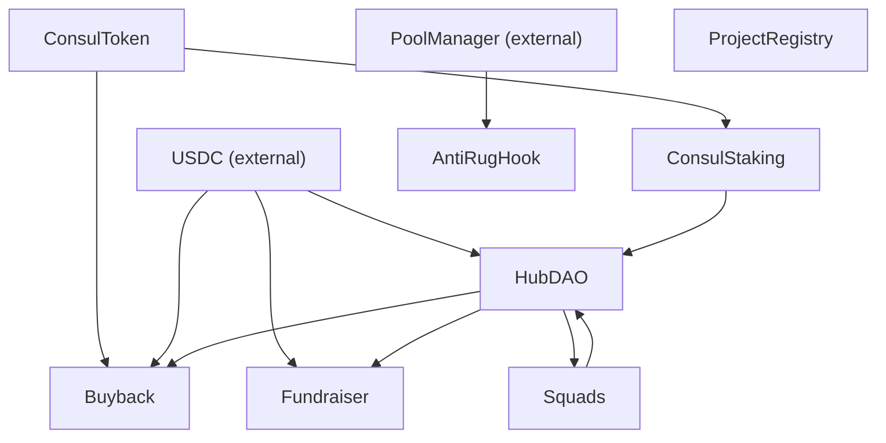

# ConsulDAO Smart Contracts

## Architecture Overview

## Contracts

### 1. ConsulToken

**File:** `ConsulToken.sol`
**Role:** ERC20 governance token with 100M max supply, burn, permit, and vote delegation support.
**Constructor:** `(address _initialOwner)`
**Key features:**
- ERC20Burnable, ERC20Permit, ERC20Votes
- One-time `initialMint()` by owner
- Ongoing `mint()` by owner (capped at 100M total)
- Standard `burn()` reduces totalSupply

### 2. ConsulStaking

**File:** `ConsulStaking.sol`
**Role:** Stake CONSUL tokens for voting power with time-lock multipliers.
**Constructor:** `(address _consulToken, address _initialOwner)`
**Dependencies:** ConsulToken
**Key features:**
- Stake/unstake CONSUL
- Lock periods with voting power multipliers (1x–3x)
- Lock extension support
- Queried by HubDAO for governance weight

### 3. HubDAO

**File:** `HubDAO.sol`
**Role:** Main DAO treasury (USDC-based), quarterly budget proposals, governance voting, veto power.
**Constructor:** `(address _treasuryToken, address _initialOwner)`
**Dependencies:** USDC (external)
**Post-deploy wiring:**
- `setStakingContract(ConsulStaking)`
- `setBuybackContract(Buyback)`
- `setSquadsContract(Squads)`
**Key features:**
- Quarterly budget proposals and voting
- Treasury management with USDC
- Veto power for owner
- Fund squad budgets

### 4. Buyback

**File:** `Buyback.sol`
**Role:** Buy CONSUL with USDC via DEX and burn it to reduce supply.
**Constructor:** `(address _usdc, address _consulToken, address _hubDao, address _initialOwner)`
**Dependencies:** USDC, ConsulToken, HubDAO
**Key features:**
- Execute buyback via DEX router
- Burn purchased CONSUL (reduces totalSupply)
- Configurable pool fee and DEX router
- Restricted to HubDAO or owner

### 5. Fundraiser

**File:** `Fundraiser.sol`
**Role:** Crowdfunding contract with refund if goal not met within duration.
**Constructor:** `(address _initialOwner, address _treasury, address _contributionToken, uint256 _goal, uint256 _durationSeconds)`
**Dependencies:** USDC (contribution token), HubDAO (treasury)
**Key features:**
- Time-limited fundraising
- Automatic refund if goal not reached
- Funds forwarded to treasury on success
- Contribution tracking per address

### 6. Squads

**File:** `Squads.sol`
**Role:** Specialized team squads (Admissions, Services, Treasury) with tasks and budgets.
**Constructor:** `(address _initialOwner)`
**Post-deploy wiring:**
- `setHubDao(HubDAO)`
**Key features:**
- Create squads with type classification
- Task creation, assignment, completion, approval
- Budget allocation from HubDAO
- Member management

### 7. ProjectRegistry

**File:** `ProjectRegistry.sol`
**Role:** On-chain project registry (ENS-like) for project identity and metadata.
**Constructor:** none (no arguments)
**Key features:**
- Register projects with manifest URI
- Update manifest
- Transfer project ownership
- Query projects by name or owner

### 8. AntiRugHook

**File:** `AntiRugHook.sol`
**Role:** Uniswap v4 hook that blocks founder token sells during vesting period.
**Constructor:** `(IPoolManager _poolManager)`
**Dependencies:** Uniswap v4 PoolManager (external)
**Key features:**
- Vesting schedule with cliff
- Blocks founder sells during vesting
- Linear vesting after cliff
- Per-pool configuration

> **Note:** Uniswap v4 hooks require the contract address to encode hook permissions in specific address bits. This typically requires `CREATE2` with a mined salt. For the hackathon MVP, deployed normally with this limitation noted.

## Deployment Order

| Phase | Contract | Notes |
|-------|----------|-------|
| 1 | ConsulToken | No dependencies |
| 1 | ProjectRegistry | No dependencies |
| 1 | Squads | No dependencies |
| 2 | ConsulStaking | Needs ConsulToken |
| 2 | HubDAO | Needs USDC address |
| 2 | Buyback | Needs USDC, ConsulToken, HubDAO |
| 2 | Fundraiser | Needs USDC, HubDAO |
| 3 | AntiRugHook | Needs PoolManager |
| 4 | Post-deploy wiring | Link contracts together |

## External Dependencies

| Contract | Address (Base Sepolia) |
|----------|----------------------|
| USDC | `0x036CbD53842c5426634e7929541eC2318f3dCF7e` |
| Uniswap v4 PoolManager | `0x05E73354cFDd6745C338b50BcFDfA3Aa6fA03408` |

## Test Mocks

Located in `contracts/test/`:
- `MockSwapRouter.sol` — Mock DEX router for Buyback testing

