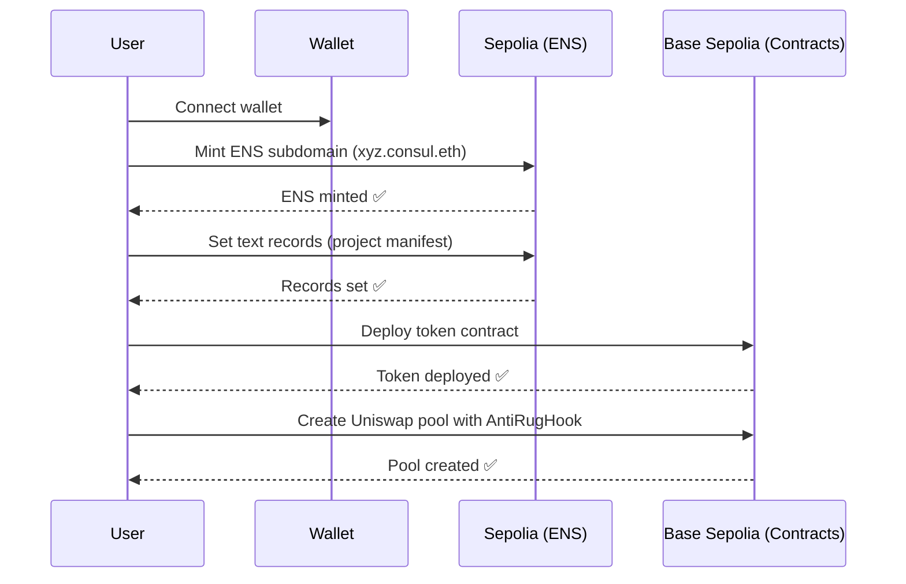

# ConsulDAO Cross-Chain Architecture

## Overview

ConsulDAO uses a **multi-chain setup** to optimize for both functionality and cost:

- **Sepolia (Ethereum L1 testnet)**: ENS subdomain minting and text records
- **Base Sepolia (L2 testnet)**: Smart contracts (HubDAO, AntiRugHook, tokens, etc.)

## Why This Architecture?

| Feature | Chain | Reason |
|---------|-------|--------|
| ENS Identity | Sepolia | Official ENS testnet with full support |
| Smart Contracts | Base Sepolia | Cheaper gas fees on L2 |
| Transactions | Base Sepolia | Fast finality, low cost |

## Chain IDs

```typescript
sepolia: 11155111        // ENS operations
baseSepolia: 84532       // Contract operations
```

## User Flow



## Implementation

### 1. Wallet Configuration

Users need to:
1. **Add both networks** to their wallet (MetaMask, Coinbase Wallet, etc.)
2. **Switch networks** when prompted by the app

### 2. ENS Operations (Sepolia)

```typescript
// hooks/useENS.ts
import { sepolia } from "wagmi/chains";

const hash = await writeContractAsync({
  address: ENS_PUBLIC_RESOLVER_ADDRESS,
  abi: ENS_RESOLVER_ABI,
  functionName: "setText",
  args: [node, key, value],
  chainId: sepolia.id, // ← Force Sepolia
});
```

### 3. Contract Operations (Base Sepolia)

```typescript
// Default chain in OnchainKitProvider
<OnchainKitProvider
  chain={baseSepolia} // ← Default to Base Sepolia
>
```

## Network Switching

The app will automatically prompt users to switch networks when needed:

- **ENS minting**: Switch to Sepolia
- **Token operations**: Switch to Base Sepolia
- **Governance voting**: Base Sepolia
- **Treasury operations**: Base Sepolia

## Testnet Faucets

Users need testnet ETH on both chains:

| Chain | Faucet |
|-------|--------|
| Sepolia | https://sepoliafaucet.com/ |
| Base Sepolia | https://www.coinbase.com/faucets/base-ethereum-sepolia-faucet |

## Contract Addresses

### Sepolia (ENS)
- ENS Registry: `0x00000000000C2E074eC69A0dFb2997BA6C7d2e1e`
- Public Resolver: `0x8FADE66B79cC9f707aB26799354482EB93a5B7dD`

### Base Sepolia (Contracts)
See `lib/deployed-addresses.ts` for full list:
- HubDAO: `0x0104f0a251C08804fb8F568EB8FEd48503BAf9D5`
- AntiRugHook: `0xDF2AC9680AA051059F56a863E8D6719228d71080`
- ConsulToken: `0x1d40167E2677dE949d282976EeeBB0eFD918F671`
- etc.

## Prize Submission Notes

For hackathon judges:

1. **ENS Integration**: Transactions on Sepolia (official ENS testnet)
2. **Uniswap v4 Hook**: Deployed on Base Sepolia
3. **Circle/USDC**: Base Sepolia (USDC: `0x036CbD53842c5426634e7929541eC2318f3dCF7e`)

## Production Migration

For mainnet deployment:

```typescript
// Change chains
sepolia → mainnet (ENS)
baseSepolia → base (contracts)

// Update addresses
ENS_REGISTRY_ADDRESSES.mainnet
DEPLOYED_ADDRESSES → redeploy on Base mainnet
```

