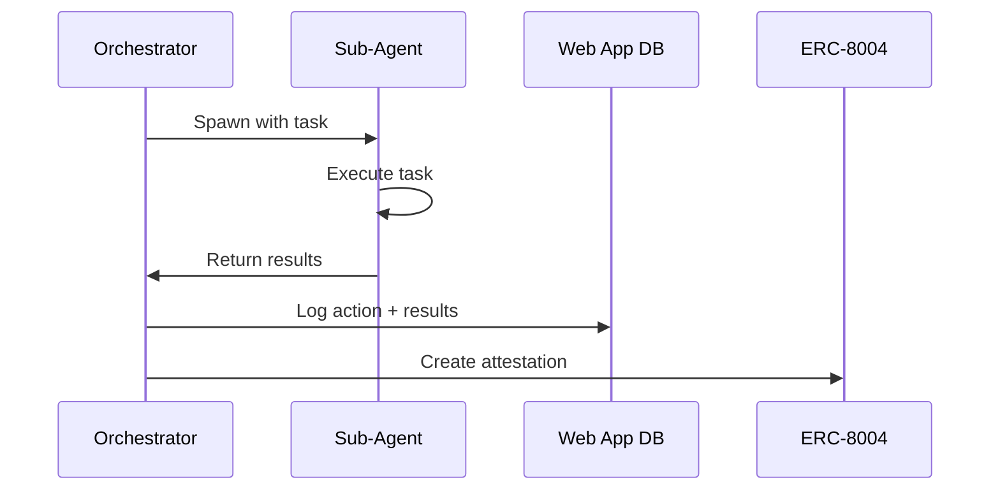

# ConsulDAO Agent Integration Design

## Overview

AI agents integrate into the 3-squad governance structure while preserving human decision authority.

**Core Principle**: Agents propose and execute. Humans approve and sign.

---

## Architecture

```
┌──────────────────────────────────────┐
│  Local OpenClaw (Admin Co-Founder)   │
│  - Always running on-device          │
│  - Orchestrates sub-agents           │
│  - Your trusted execution layer      │
└────────────────┬─────────────────────┘
                 │ spawns
      ┌──────────┼──────────┐
      ▼          ▼          ▼
  ┌───────┐  ┌───────┐  ┌─────────┐
  │Screen │  │  Ops  │  │Treasury │
  │ Agent │  │ Agent │  │ Monitor │
  └───┬───┘  └───┬───┘  └────┬────┘
      │          │           │
      └──────────┼───────────┘
                 ▼
  ┌──────────────────────────────────┐
  │     Web App + Database           │
  │   (Logs, Status, Dashboard)      │
  └──────────────┬───────────────────┘
                 │
  ┌──────────────▼───────────────────┐
  │   ERC-8004 Reputation Registry   │
  │   (On-chain attestations)        │
  └──────────────────────────────────┘
```

---

## Orchestrator (OpenClaw)

The **Admin Co-Founder** runs locally on your device 24/7.

| Aspect | Details |
|--------|---------|
| Runtime | Local machine, always-on |
| Role | Spawn sub-agents, coordinate tasks, manage state |
| Authority | Full control over sub-agent lifecycle |
| Persistence | Local DB + sync to web app |

**Responsibilities**:
- Monitor governance proposals and action queues
- Spawn appropriate sub-agents for pending tasks
- Aggregate logs and push to web app database
- Create on-chain attestations via ERC-8004

---

## Sub-Agents

### 1. Screening Agent (Admissions)

| Aspect | Details |
|--------|---------|
| Trigger | New application submitted |
| Inputs | Pitch deck, tokenomics, founder wallets |
| Outputs | Risk score, due diligence report |
| Authority | Read-only |

**Tasks**: Wallet analysis, tokenomics red flags, competitor research.

---

### 2. Operations Agent (Services)

| Aspect | Details |
|--------|---------|
| Trigger | Approved task in queue |
| Inputs | Task spec, budget, project config |
| Outputs | Tx hashes, execution logs |
| Authority | Execute pre-approved on-chain actions |

**Tasks**: Deploy contracts, mint ENS, configure treasury.

*This is the existing incubator agent.*

---

### 3. Treasury Monitor (Treasury)

| Aspect | Details |
|--------|---------|
| Trigger | Scheduled + anomaly detection |
| Inputs | On-chain treasury data, prices |
| Outputs | Reports, alerts, buyback proposals |
| Authority | Read-only |

**Tasks**: Track balances, detect anomalies, propose buybacks.

---

## ERC-8004 Reputation

On-chain attestations provide verifiable track record.

### Attestation Types

| Actor | Attestation |
|-------|-------------|
| Screening Agent | `analyzed:projectId, riskScore:X` |
| Ops Agent | `deployed:tokenAddress, project:X` |
| Projects | `graduated:incubation`, `passed:vesting` |
| Founders | `launched:N projects via ConsulDAO` |

### Schema

```solidity
struct Attestation {
    address subject;      // Agent or founder address
    bytes32 schemaId;     // Type of attestation
    bytes data;           // Encoded details
    uint64 timestamp;
    address attester;     // Orchestrator address
}
```

### Composable Reputation

Other protocols can query:
- "Has this founder been vetted by ConsulDAO?"
- "What's this agent's success rate?"
- "Did this project pass vesting?"

---

## Data Flow



---

## Security Model

| Agent | Read Chain | Write Chain | Sign Txns | Spawn |
|-------|-----------|-------------|-----------|-------|
| Orchestrator | ✅ | ✅ (attestations) | ❌ | ✅ |
| Screening | ✅ | ❌ | ❌ | ❌ |
| Operations | ✅ | ✅ (approved) | ❌ | ❌ |
| Monitor | ✅ | ❌ | ❌ | ❌ |

**Guardrails**:
1. No autonomous fund movement — Safe multisig required
2. Budget caps per task
3. All actions logged to DB + chain
4. Human kill switch via governance

---

## Implementation Phases

### Phase 1: Foundation ✅
- [x] Operations Agent (incubator)
- [x] DAO dashboard
- [ ] Action logging schema

### Phase 2: Orchestrator
- [ ] OpenClaw local setup
- [ ] Sub-agent spawning
- [ ] DB sync to web app

### Phase 3: Reputation
- [ ] ERC-8004 contract deployment
- [ ] Attestation creation flow
- [ ] Reputation dashboard

### Phase 4: Intelligence
- [ ] Screening Agent with wallet analysis
- [ ] Treasury Monitor with alerts
- [ ] Admissions voting UI

---

## Uniswap v4 Agent Tasks

| Task | Agent Action | Human Approval |
|------|-------------|----------------|
| Pool Deployment | Deploy LP for project token | Config (fee tier, price) |
| Liquidity Provision | Add CONSUL/USDC liquidity | Amount + range |
| Anti-Rug Enforcement | Hook blocks founder sells during vesting | Config only |
| Buyback Execution | Swap USDC → CONSUL | Approve amount |
| Fee Collection | Claim accumulated LP fees | Threshold-based |
| Rebalancing | Adjust LP range | Approve new range |

---

## Circle (USDC) Agent Tasks

| Task | Agent Action | Human Approval |
|------|-------------|----------------|
| Treasury Deposits | Monitor + log incoming USDC | None (read-only) |
| Budget Disbursements | Transfer approved budgets | Pre-approved |
| Cross-Chain Bridging | Move USDC via CCTP | Destination + amount |
| Yield Farming | Deposit idle USDC to Aave/Compound | Approve strategy |
| Invoice Payments | Pay contractors from budget | Approve invoice |

---

## High-Value Automations

### Auto Buyback
```
Trigger:  CONSUL price drops 20% from ATH
Agent:    Propose buyback with USDC amount
Human:    Approve via governance
Agent:    Execute swap on Uniswap, burn tokens
```

### Project Token Launch
```
Agent:  Deploy token → Create pool → Add liquidity → Activate AntiRugHook
Human:  Approve config upfront (one-time)
```

### Treasury Yield
```
Agent:  Monitor idle USDC → Deposit to yield → Claim rewards
Human:  Approve strategy once
```

### Cross-Chain Fundraising (CCTP)
```
Contributor:  Sends USDC from Ethereum/Arbitrum
Agent:        Bridges to Base via CCTP → Credits contribution
Human:        None (fully automated)
```
